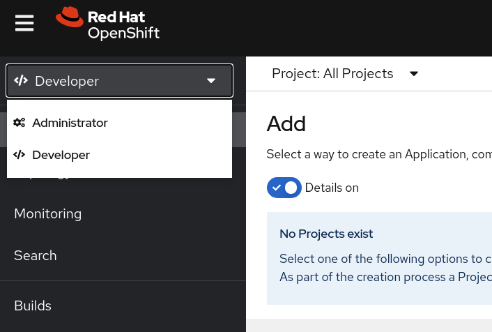
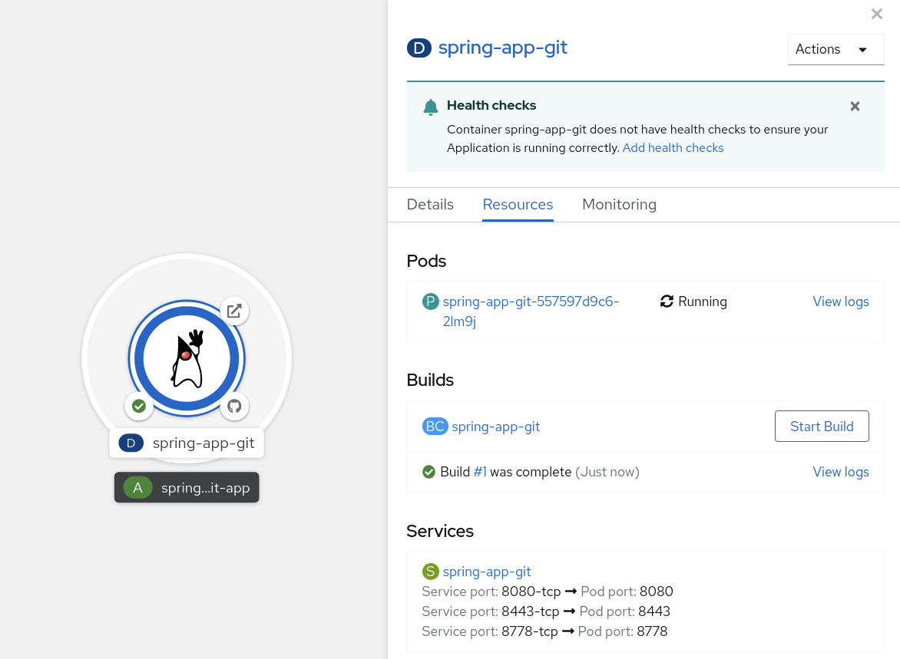

This hands-on lab helps users to get started with application deployment on OpenShift. The module will explore both Web UI and CLI interfaces and offer sample application deployment examples using Git and pre-built Docker images.


## Exploring the Web Console

The OpenShift Web interface easily accessible via the `homeroom` learning environment. To access it, navigate to the upper section of the Web interface and select `Console` tab.

### Explore

Take a few minutes to explore!

The Web interface presents information in *Administrator* and *Developer* perspectives.



Under `+Add` section of the *Developer* view, note various catalogue and sample applications available for exploring.

### Create a Project

OpenShift Projects is a mechanism to scope resources in a cluster, see more information at [Working with Projects](https://docs.openshift.com/container-platform/4.8/applications/projects/working-with-projects.html) .

To create a project click the drop-down menu to see `All Projects` and select `Create Project`. Select a unique Project name that will be used for application deployment for example `user2-project1`.


### Deploy Spring Boot Application

Deploy Java Spring Boot application from source code to using `S2I` (source-to-image).

* Click on `+Add` -> `From Git`.
* Enter `https://github.com/kskels/spring-app.git` for `Git repo URL`.
* Click on `Show advanced Git options` and enter `main` for `Git Reference`. 
* Optionally modify other values and click `Create`.

Under `Topology` view a new build and application for `spring-app-git` will be created. The build will take a few mintes to finish. Meanwhile, explore the application build and deployment, observe logs and various objects created.




## Exploring the CLI

The OpenShift CLI is easily accessible via the `homeroom` learning environment. To access it, navigate to the upper section of the Web interface and select `Terminal` tab.


### Create a Project

```bash
oc new-project user2-project2
```

### Deploy .NET Core Application

Deploy the application via Git repo using Dockerfile

```bash
$ oc new-app https://github.com/kskels/aspnet-core-app.git
```

New build from the Dockerfile will be started

```bash
$ oc get pods
NAME                      READY   STATUS    RESTARTS   AGE
aspnet-core-app-1-build   1/1     Running   0          15s

$ oc logs -f aspnet-core-app-1-build
(...)
```

Once the build is finished, the application will be deployed. 

```bash

$ oc get pods
NAME                               READY   STATUS      RESTARTS   AGE
aspnet-core-app-1-build            0/1     Completed   0          3m51s
aspnet-core-app-7f6df695f8-v4889   1/1     Running     0          2m42s

$ oc logs -f aspnet-core-app-7f6df695f8-v4889
(...)
```

Observe all the objects that are created during `new-app`.

```bash
$ oc get all
```

### Create a Project

```bash
oc new-project user2-project3
```

### Deploy from Image

Additionally to `redis6` image, expore other Red Hat certified [container images](https://catalog.redhat.com/software/containers/explore) .

```bash
oc new-app --docker-image=registry.redhat.io/rhel8/redis-6
```

Similar to the previous application, observe logs, and objects created by the `new-app` command.

Switch to the Console and explore all the projects and deployed applications.
